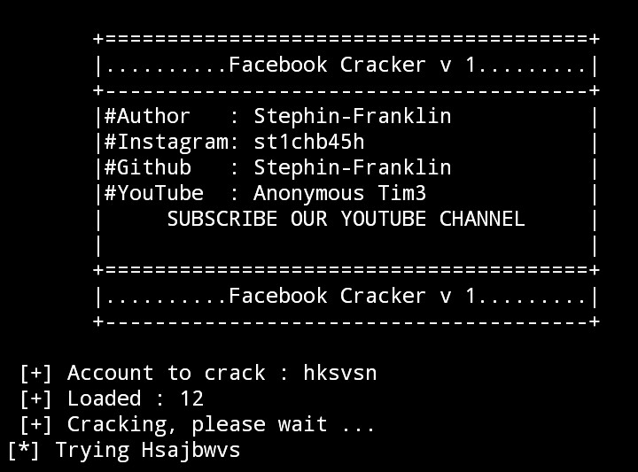

# FBCracker
FBCracker is a Facebook brute force tool, launches an attack by guessing the target password with a set of wordlist provided.  
so this is the same as you try to login to someone's account while guessing the password, if the password you are trying is wrong, you will think of another password that might be used by the target to login to the account but this way might be a bit longer, but with FBBrute this will make it easier.  
you only need to create one file with a collection of passwords then enter the username, email or ID of the target then press start crack...  

### Installation and Using FBCracker
```bash
$ apt-get install python git
$ git Clone https://github.com/DevilTeam0/Hack-FB
$ cd FBCracker
$ python FBCracker.py
```

### Contact Me 

Facebook  : Devil Team
Instagram : _Devil_Team_

Subscribe Our YouTube Channel 

https://youtube.com/channel/UCkheB8OQaPfmZf4jydm3A5g
